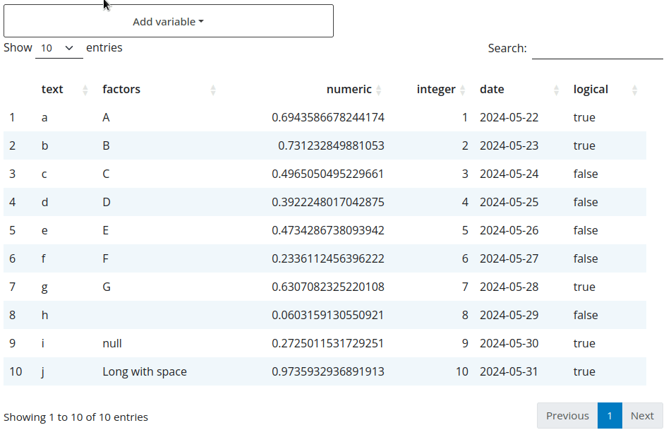

<!-- badges: start -->
<!-- badges: end -->

# flexfilter

Flexible filters for shiny.

Create a filter from a `data.frame` that enables users to dynamically add
filters on each column, the filter is dynamically generating the appropriate
input for the selected column based on the type of the column.

## Example

```r
library(shiny)
library(flexfilter)

data <- data.frame(
  text = letters[1:10],
  factors = as.factor(LETTERS[1:10]),
  numeric = runif(10),
  integer = 1:10,
  date = seq.Date(Sys.Date()-9, Sys.Date(), by = "day"),
  logical = sample(c(T, F), 10, replace = TRUE)
)

ui <- fluidPage(
  theme = bslib::bs_theme(5L),
  flexfilterUI("filter"),
  DT::DTOutput("table")
)

server <- function(input, output, session) {
  values <- flexfilter_server("filter", data)

  output$table <- DT::renderDT({
    if(!length(values()$exprs))
      return(data)

    data |>
      dplyr::filter(!!!values()$exprs) |>
      DT::datatable()
  })
}

shinyApp(ui, server)
```



This product was funded by [The Association of State and Territorial Health Officials](https://www.astho.org),
and was supported by [OE22-2203: Strengthening U.S. Public Health Infrastructure, Workforce, and Data Systems grant](https://www.cdc.gov/infrastructure/phig/index.html)
Number 6 NE11OE000066, funded by CDC. 
Its contents are solely the responsibility of the authors and do not necessarily represent 
the official views of CDC.
