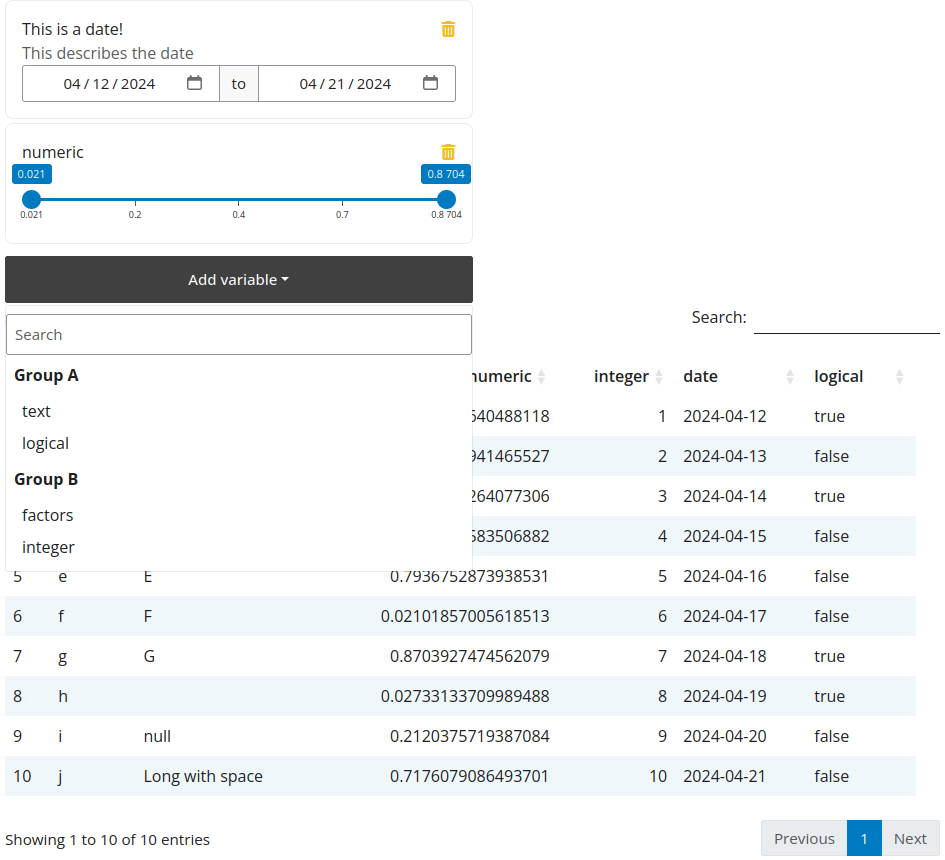

# Attributes

Inputs can be modified with `attributes`:

- `label`: Change the label of the input.
- `description`: Adds a description to the input.
- `group`: Place inputs in groups (subheading).

!!! warning
    If you use the `group` attribute make sure all your columns are placed within
    a group or they will be dropped from the filter.

```r
library(shiny)
library(flexfilter)

data <- data.frame(
  text = letters[1:10],
  factors = as.factor(c(LETTERS[1:7], NA_character_, "null", "Long with space")),
  numeric = runif(10),
  integer = 1:10,
  date = seq.Date(Sys.Date()-9, Sys.Date(), by = "day"),
  logical = sample(c(T, F), 10, replace = TRUE)
)

# label and description
attr(data$date, "label") <- "This is a date!"
attr(data$date, "description") <- "This describes the date"

# groups
attr(data$text, "group") <- "Group A"
attr(data$numeric, "group") <- "Group A"
attr(data$date, "group") <- "Group B"
attr(data$integer, "group") <- "Group B"
attr(data$logical, "group") <- "Group A"
attr(data$factors, "group") <- "Group B"

ui <- fluidPage(
  theme = bslib::bs_theme(5L),
  div(
    style = "width:50%",
    flexfilterUI("filter"),
  ),
  DT::DTOutput("table")
)

server <- function(input, output, session) {
  # only return variable names
  values <- flexfilter_server("filter", data, search_threshold = 0)

  observe({
    print(values())
  })

  output$table <- DT::renderDT({
    print(values())
    if(!length(values()))
      return(data)

    data |>
      dplyr::filter(!!!values()$exprs) |>
      DT::datatable()
  })
}

shinyApp(ui, server, options = list(port = 3003L))
```


