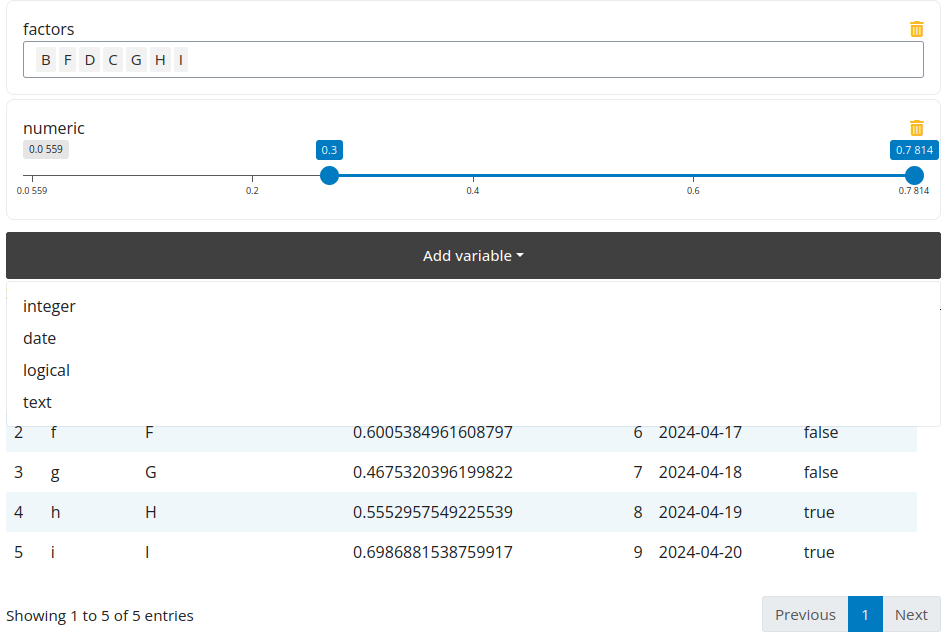

# Get Started

At its core flexfilter is a shiny module with a UI and server component.

Call `flexfilterUI()` where you want the filter to be placed in your interface.
And call `flexfilter_server()` in your server; this will return a reactive containing
either the filtering expression to use with dplyr or a vector of variables that you
want to select from your `data.frame`.

Flexfilter will create a different input based on the type of the column:

- `factor`: creates a selectize input where multiple values can be selected.
- `character`: creates a text input.
- `numeric` and `integer`: creates a range input where a range can be selected.
- `date`: creates a date range input.
- `logical`: creates a checkbox input.

!!! note
    Note how the expression returned by the `flexfilter_server()` function is being used below (`dplyr::filter(data, !!!values()$exprs)`)

```r
library(shiny)
library(flexfilter)

data <- data.frame(
  text = letters[1:10],
  factors = as.factor(LETTERS[1:10]),
  numeric = runif(10),
  integer = 1:10,
  date = seq.Date(Sys.Date()-9, Sys.Date(), by = "day"),
  logical = sample(c(T, F), 10, replace = TRUE)
)

ui <- fluidPage(
  theme = bslib::bs_theme(5L),
  # flexfilter UI
  flexfilterUI("filter"),
  DT::DTOutput("table")
)

server <- function(input, output, session) {
  # flexfilter server
  values <- flexfilter_server("filter", data)

  output$table <- DT::renderDT({
    if(!length(values()$exprs))
      return(data)

    data |>
      # filter values
      dplyr::filter(!!!values()$exprs) |>
      DT::datatable()
  })
}

shinyApp(ui, server)
```


