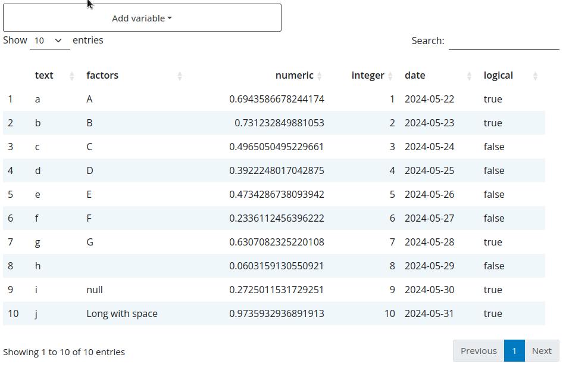

# Search

The `flexfilter_server()` function accepts a `search_threshold` argument which 
allows displaying a search functionality when the number of columns in the `data.frame`
exceeds the `search_threshold`.

```r
library(shiny)
library(flexfilter)

data <- data.frame(
  text = letters[1:10],
  factors = as.factor(LETTERS[1:10]),
  numeric = runif(10),
  integer = 1:10,
  date = seq.Date(Sys.Date()-9, Sys.Date(), by = "day"),
  logical = sample(c(T, F), 10, replace = TRUE)
)

ui <- fluidPage(
  theme = bslib::bs_theme(5L),
  # flexfilter UI
  flexfilterUI("filter"),
  DT::DTOutput("table")
)

server <- function(input, output, session) {
  # flexfilter server
  values <- flexfilter_server("filter", data, search_threshold = 0L)

  output$table <- DT::renderDT({
    if(!length(values()$exprs))
      return(data)

    data |>
      # filter values
      dplyr::filter(!!!values()$exprs) |>
      DT::datatable()
  })
}

shinyApp(ui, server)
```


