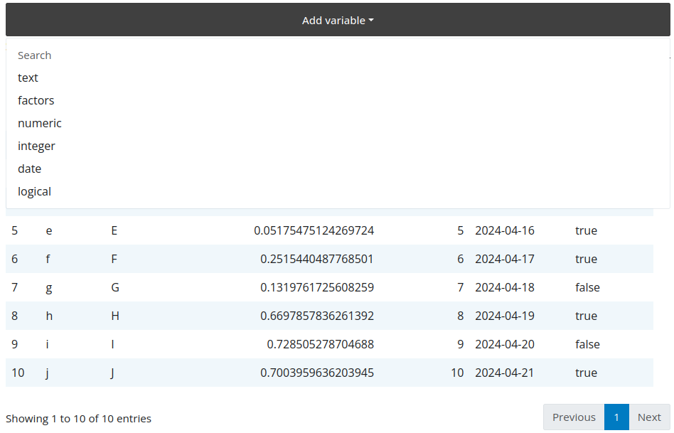

# Variables

You can also use the flexfilter not to filter but to display and select
columns from the `data.frame`, this has little to advantage over using a selectize 
input; it was added to have a consistent look and feel with the filter.

!!! note
    The `flexfilter_server()` will then return a `vector` of variables to select.

```r
library(shiny)
library(flexfilter)

data <- data.frame(
  text = letters[1:10],
  factors = as.factor(LETTERS[1:10]),
  numeric = runif(10),
  integer = 1:10,
  date = seq.Date(Sys.Date()-9, Sys.Date(), by = "day"),
  logical = sample(c(T, F), 10, replace = TRUE)
)

ui <- fluidPage(
  theme = bslib::bs_theme(5L),
  # flexfilter UI
  flexfilterUI("filter"),
  DT::DTOutput("table")
)

server <- function(input, output, session) {
  # flexfilter server
  values <- flexfilter_server("filter", data, variables_only = TRUE)

  output$table <- DT::renderDT({
    if(!length(values()))
      return(data)

    data |>
      # filter values
      dplyr::select(values()) |>
      DT::datatable()
  })
}

shinyApp(ui, server)
```


